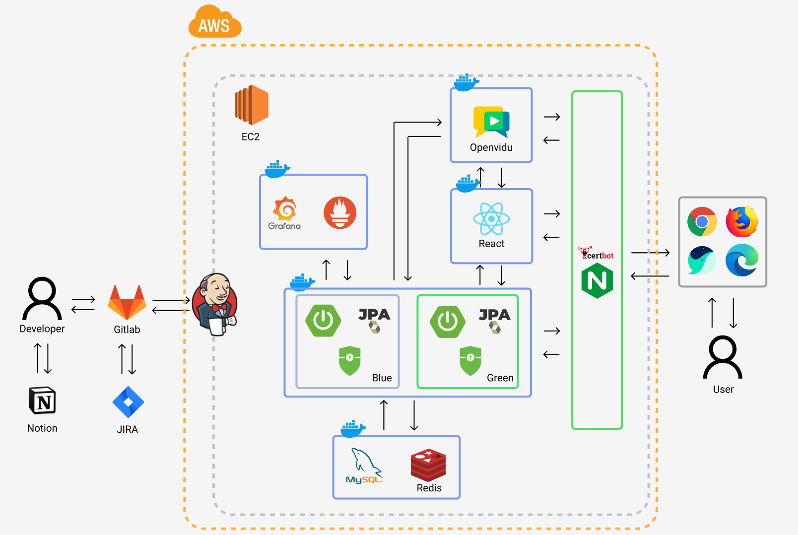
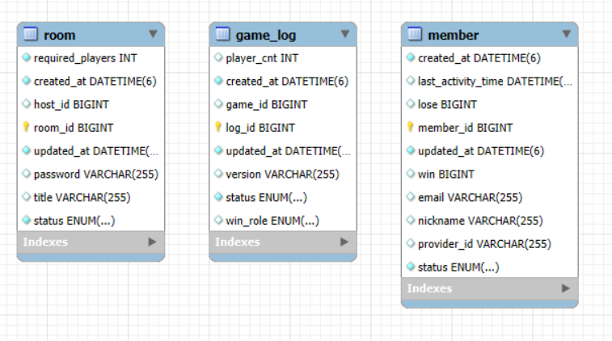

# 1. 서비스 소개

### 온라인에서도 친구들과 함께, 긴장감 넘치는 생존 게임

🧟 Naming : "지금 우리 학교는"의 생존 테마와 마피아 게임의 추리 요소를 결합한 웹 기반 마피아 게임

  - 기간: 25.01.13 ~ 25.02.21 (6주)
  - 인원: 7명(BE_3, FE_4)

  ### 주요 기능
  
**실시간 화상 마피아 🎮**

- WebRTC 기반 실시간 음성채팅 
- Redis 기반 게임 진행 관리
- 직업군별 특수 능력과 투표 시스템

**캐릭터 이동과 상호작용 🏃**

- Phaser3 엔진 기반 캐릭터 조작
- 실시간 위치 공유와 오브젝트 상호작용
- 직관적인 UI/UX

  
## 📃 문서
[💻 Notion](https://curvy-tithonia-e7e.notion.site/175592af215280a1816fff4f08dabfef?pvs=4)

---

# 2. 🔍 개발 환경
  
## 2-1. 기술 스택

## 🚀 FrontEnd

<table>
  <tr>
    <td> HTML</td>
    <td> CSS(SCSS)</td>
    <td> JavaScript</td>
    <td> React.js</td>
    <td> Phaser</td>
  </tr>
</table>

## 🚀 BackEnd

<table>
  <tr>
    <td> Java</td>
    <td> SpringBoot</td>
    <td> Hibernate</td>
    <td> OpenVidu</td>
    <td> MySQL</td>
    <td> Redis</td>
  </tr>
</table>

## 🚀 Infra

<table>
  <tr>
    <td> AWS</td>
    <td> Docker</td>
    <td> Nginx</td>
    <td> Prometheus</td>
    <td> Grafana</td>
    <td> Jenkins</td>
  </tr>
</table>


## 2-2. 서비스 아키텍처
  


## 2-3 ERD


------------------------------------------------------  

# 3. 🦈 주요 기능
------------------------------------------------------
  
## 3-1. 소셜 & 게스트 로그인


(간편한 로그인 시스템)

- 소셜 로그인 지원 (Kakao)
- 게스트 로그인으로 빠른 게임 참여
- 직관적인 로그인 UI/UX

## 3-2. 로비 & 방 관리


(손쉬운 게임 참여와 방 관리 시스템)

- 실시간 방 목록 확인 및 생성
- 방 생성 시 게임 옵션 커스텀 설정
- 인원 수에 따른 방 상태 표시
- 생존규칙(게임사용법) 확인

## 3-3. 방 입장 & 게임 준비


(방장과 참가자들의 게임 준비 시스템)

- 방장의 게임 시작/강제퇴장 권한
- 참가자별 준비 완료 상태 표시
- 실시간 참가자 목록 업데이트
- 게임 시작 전 채팅으로 소통

## 3-4. 게임 시작 & 직업 배정
![게임시작] -> gif 만들기

(긴장감 넘치는 게임시작과 비밀스러운 직업 배정)

- 랜덤 직업 배정 (생존자/감염자/의사)
- 직업별 특수 능력 안내 (게임사용법 참조)
- 게임 규칙 알림
- 밤/낮 사이클 시작

## 3-5. 게임 진행 & 상호작용
![게임진행] -> gif 만들기

(실시간으로 진행되는 생존과 추리의 현장)

- 실시간 음성 채팅
- 탑뷰 맵에서 캐릭터 자유 이동
- 오브젝트와 상호작용

## 3-6. 투표 & 게임 종료
![투표시스템] -> gif 만들기

(운명을 결정짓는 투표와 게임의 결말)

- 실시간 투표 시스템
- 직업별 키보드 단축키로 능력 사용
- 투표 결과에 따른 페이지 및 권한 변경
- 승리 조건 달성 시 게임 종료
- 역할군에서 승패 결정

--------------------------

# 4. 🛡 배포
------------------------------------------------------
  - https
    - certbot과 Nginx를 통한 SSL 인증
    - EC2 제공 도메인 'http://i12D101.p.ssafy.io/' 사용하여 인증
  - 자동 배포
    - Gitlab에서 web hook 설정을 통해 jenkins 빌드 유발
    - jenkins의 shell script 실행 기능을 이용하여 git pull -> merge request -> docker build -> run
    - Nginx로 reverse proxy 설정
    
--------------------------

# 5. 🛠  Tools
------------------------------------------------------
<table>
  <tr>
    <td> IntelliJ</td>
    <td> VSCode</td>
    <td> Figmat</td>
    <td> Git</td>
    <td> Jira</td>
    <td> Notion</td>
    <td> Discord</td>
  </tr>
</table>

--------------------------


# 6. Ground rule
--------------------------------------------

  ## 6-1 Commit Convention
  ```

커밋 메시지는 아래 규칙을 따릅니다.

### 커밋 메시지 구조

### Type
- `feat` : 새로운 기능 추가/수정/삭제
- `fix` : 버그, 오류 해결
- `refact` : 코드 리팩토링 (기능 변경 없음)
- `docs` : 문서 수정 (README 등)
- `test` : 테스트 코드 관련
- `chore` : 빌드, 설정 파일 수정
- `build` : 라이브러리 추가/삭제
- `!HOTFIX` : 긴급 버그 수정


### 예시
- feat : 로그인 기능 구현
- fix : 로그인 validation 오류 수정
- refact : 중복 코드 제거
- docs : README 업데이트
- test : 로그인 테스트 코드 추가
- chore : package.json 수정
- build : axios 라이브러리 추가
- !HOTFIX : 서버 연결 오류 긴급 수정

### 규칙
- type은 영어로, 설명은 한글로 작성
- subject는 50자 이내로 작성
- 마침표 사용하지 않음

  ```

  ## 6-2 MR Template
  ```

### 📋 기본 정보
**브랜치**
`feature_room` → `dev_BE`

**타입**
- [ ] Feat (기능 추가/수정)
- [ ] Fix (버그 수정)
- [ ] Refactor (코드 리팩토링)
- [ ] Test (테스트 코드)

### ✨ 변경 사항
- 구현 내용 요약
- 주요 변경점 기술

### ✅ 테스트
- [ ] 로컬 테스트 완료
- [ ] API 테스트 완료

### 👥 리뷰 프로세스
1. Assignee가 MR 생성 후 Reviewer 지정
2. Reviewer 코드 리뷰 진행
  - Approve: MR 승인
  - Request changes: 수정 필요
3. 수정 요청 시:
  - 코드 수정 후 재push
  - 수정 완료 댓글 작성
  - Reviewer 재검토 요청
4. 최종 승인 시 merge 진행

```

  ## 6-3 Code Convention (Google Java Style Guide 기반)
  ```

### 기본 원칙
- 가독성을 최우선으로 합니다
- 일관된 코드 스타일을 유지합니다
- IntelliJ 자동 포매팅을 활용합니다

### 주요 규칙

**1. 파일 형식**
- 인코딩: UTF-8
- 들여쓰기: 4칸 공백
- 최대 줄 길이: 100자

**2. 네이밍**
- 클래스: PascalCase (`MyClass`)
- 변수/메소드: camelCase (`myVariable`)
- 상수: UPPER_SNAKE_CASE (`MAX_COUNT`)

**3. 코드 포맷팅**
- 중괄호는 같은 줄에 시작 (`if (condition) {`)
- 연산자 앞뒤 공백 필수 (`a + b`)
- 콤마 뒤 공백 필수 (`method(a, b)`)

### IntelliJ 설정 방법
1. Settings > Code Style > Java
2. Scheme > Import Scheme > Google Style
3. Actions on Save > Reformat Code 체크

자동 포매팅 단축키: 
- Windows: `Ctrl + Alt + L`
- Mac: `Command + Option + L`

  ```

--------------------------------------------


# 7. 👨‍👩‍👧‍👦 팀원 소개
------------------------------------------------------
# 팀원 역할 및 담당

| 김성민 | 배준영 | 양대원 | 전준표 | 김진우 | 이성욱 | 정해빈 |
| ----- | ------ | ----- | ------ | ----- | ------ | ------ |
| <a href="https://github.com/osy9536"></a> | <a href="https://github.com/osy9536"></a> | <a href="https://github.com/osy9536"></a> | <a href="https://github.com/osy9536"></a> | <a href="https://github.com/osy9536"></a> | <a href="https://github.com/osy9536"></a> | <a href="https://github.com/osy9536"></a>

| Contributors | Role | Position |
| ------------ | ---- | -------- |
| 김성민 | 팀장, <br /> Backend | - 유저 플로우 작성 <br> |
| 배준영 | 팀원, <br /> Backend | - 유저 플로우 작성 <br> |
| 양대원 | 팀원, <br /> Backend Lead | - 유저 플로우 작성 <br> |
| 전준표 | 팀원, <br /> Frontend Lead | - 유저 플로우 작성 <br> |
| 김진우 | 팀원, <br /> Frontend | - 유저 플로우 작성 <br> | 
| 이성욱 | 팀원, <br /> Frontend | - 유저 플로우 작성 <br> | 
| 정해빈 | 팀원, <br /> Frontend, <br /> 서기 | 유저 플로우 작성 <br>
