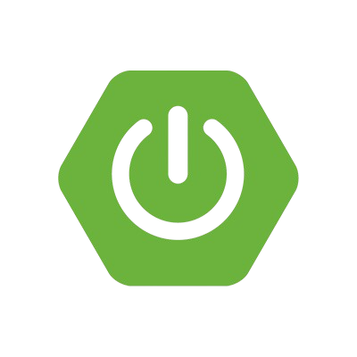

# 첫번째 배포 테스트 입니다.

error : Invalid tool ID NodeJS 22.13.0

# 서비스 소개

**[Web RTC 기반 화상 채팅 마피아 게임]**

최신 WebRTC 기술을 활용한 혁신적인 마피아 게임을 소개합니다. 전 세계 어디에서나 플레이어들과 실시간으로 소통하며 긴장감 넘치는 심리전을 펼칠 수 있습니다. 이 게임의 주요
특징은 다음과 같습니다:

**실시간 웹캠/음성 채팅**

- WebRTC 기반 실시간 음성 소통으로 몰입감 제공

**AI 감정 분석**

- 실시간 표정 분석 후 이모지로 변환하여 익명성 보장

**다양한 소통 방식**

- 음성 대화와 텍스트 채팅 모두 지원

**편리한 접근성**

- 웹 브라우저 기반으로 별도 설치 없이 즐길 수 있는 직관적인 UI

**캐릭터 조작 게임 진행**

- 캐릭터를 직접 움직이고 상호작용하여 몰입감 있는 플레이를 제공

## 2. 기획 배경

### 배경

기존 온라인 마피아 게임들은 화상, 채팅, 게임 시스템 중 일부 기능만 제공하여 완성도 높은 게임 경험을 제공하지 못했습니다.

### 목표

화상 채팅과 게임 시스템이 통합된 완성도 높은 웹 기반 마피아 게임 구현

### 주요 특징

- 실시간 화상/채팅 기능
- 랭킹 시스템과 랜덤 매칭
- 게더타운 형식의 소통 공간
- 악성 유저 관리 시스템

## 3. 서비스 화면

**메인페이지 시연 순서 → 추후 예정**

# 게임 컨텐츠 소개

---

### 마피아

**마피아, 시민, 경찰, 의사 네가지 역할로 진행되는 심리 롤플레잉 게임**

- **플레이어 수 : 6 - 8명 권장**
- **게임 시간 : 15 -20 분**

### 역할 소개 및 분배 ( 8인 기준 )

1. 마피아(2) : 마피라라는 것을 들키지 않고, 시민(경찰, 의사) 제거
2. 시민(4) : 마피아로 의심되는 사람을 추리하고 모든 마피아 소탕
3. 경찰(1) : 밤에 플레이어들의 역할 파악 및 마피아로 의심되는 사람 추측 후 시민이 승리하도록 리드
4. 의사(1) : 마피아가 죽일 것 같은 사람을 살리고 마피아로 의심되는 사람 추리하여 모든 마피아 소탕

### 승리 조건

마피아 승리 : 생존자 중 마피아와 시민 진영의 수가 같아지면 **마피아팀 승리
→**  예시 : 생존자가 마피아 2명, 시민 진영 2명이 되는 경우

시민(경찰, 의사) 승리 : 모든 마피아 검거 시 **시민팀 승리
→** 예시 : 마피아 2명을 모두 처형한 경우

### 게임 Rule

1. **낮 (자유 토론)  - 3분**
    1. 자유롭게 토론 하는 시간
    2. 이 시간 동안 시민들은 누가 마피아인지 추측하고 논의
2. **낮 투표 - 30초**
    1. 마피아로 의심되는 사람 1명 투표
    2. 최다 득표자가 2명 이상일 경우 재투표 진행
    3. 과반수 이상 득표를 받은 플레이어만 처형
    4. 과반수 미달 시 아무도 처형되지 않음
3. **최후 변론 - 30초**
    1. 처형 대상자의 최후 변론 후 최종 투표 진행 (찬/반)
    2. 과반수가 반대할 경우 처형 취소
4. **밤 - 30초**
    1. **모든 플레이어가 잠든 시간 (역할별 행동 순차 진행)**
    2. **마피아**: 조용히 시민 한 명 제거 (마피아끼리 채팅으로 의논 가능)
    3. **경찰**: 플레이어 한 명의 역할 확인
    4. **의사**: 마피아가 죽일 것 같은 사람 선택하여 살리기

### 추가 규칙

1. 죽은 플레이어는 채팅 불가
2. 밤에는 지목 외 다른 행동 불가
3. 의사는 본인을 연속으로 2번 치료 불가

# 4. 프로젝트 진행

<h2>기술 스택</h2>

  <table>
    <thead>
      <tr>
        <th>FrontEnd</th>
        <th>BackEnd</th>
        <th>Infra</th>
        <th>Tools</th>
        <th>Collaboration</th>
      </tr>
    </thead>
    <tbody>
      <tr>
        <td>
          <ul style="list-style: none; padding-left: 0; margin: 0; text-align: left;">
            <li> HTML</li>
            <li> CSS(SCSS)</li>
            <li> JavaScript</li>
            <li> React.js</li>
            <li> Python</li>
          </ul>
        </td>
        <td>
          <ul style="list-style: none; padding-left: 0; margin: 0; text-align: left;">
            <li> Java</li>
            <li> SpringBoot</li>
            <li> MySQL</li>
            <li> JPA</li>
            <li> Hibernate</li>
            <li> OpenVidu</li>
          </ul>
        </td>
        <td>
          <ul style="list-style: none; padding-left: 0; margin: 0; text-align: left;">
            <li> AWS</li>
            <li> Docker</li>
          </ul>
        </td>
        <td>
          <ul style="list-style: none; padding-left: 0; margin: 0; text-align: left;">
            <li> IntelliJ</li>
            <li> VS Code</li>
            <li> Figma</li>
            <li> Git</li>
          </ul>
        </td>
        <td>
          <ul style="list-style: none; padding-left: 0; margin: 0; text-align: left;">
            <li> Github</li>
            <li> Notion</li>
            <li> Discord</li>
            <li> JIRA</li>
          </ul>
        </td>
      </tr>
    </tbody>
  </table>

## 1. Jira

**프로젝트 및 이슈 관리를 위한 협업 도구**

- 스프린트 계획 및 진행 상황 관리
- 백로그 관리 및 작업 분배
- 이슈 트래킹 및 일정 관리

### 2. Notion

**데일리 스크럼 , API문서, 발표정리 등 문서들에 대한 저료는 Notion 활용**

- 팀 문서 작성 및 공유
- 프로젝트 일정 및 회의록 관리
- API 문서화 및 기술 문서 작성

# 5. 배포

# 6. 소감 및 배운점